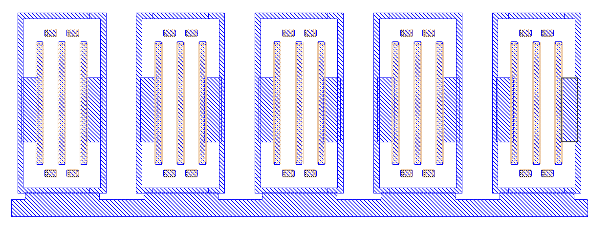
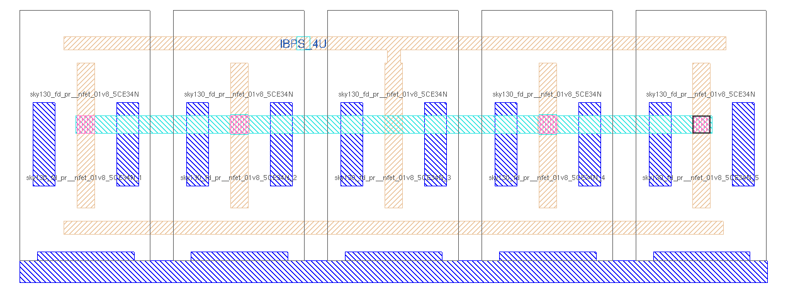

[Slideshow](https://wulffern.github.io/rply_ex0_sky130nm/) 

[PDF](https://wulffern.github.io/rply_ex0_sky130nm/README.pdf) 


# Why
I wanted to create a step by step "tutorial" for 
the flow. Both to debug the tech setup, and to make it easier
for you to learn the tools. I use a simple current mirror as
the example.

# Changelog/Plan

I've tagged the repo at each stage. That means you can 
checkout the 0.1.0 tag and do things yourself.

Make sure you follow the latest readme though, I've fixed
bugs in the readme.

When you clone main, you can do

``` bash
pandoc -s  -t slidy README.md -o README.html
```

and then open the html file.

To checkout a specific stage, do 

``` bash
git checkout 0.1.0
```

| Tag   | Status | Comment              |
|:------|:-------|:---------------------|
| 0.1.0 | v      | Fix readme           |
| 0.2.0 | v      | Made schematic       |
| 0.3.0 | v      | Typical simulation   |
| 0.4.0 | v      | Corner simulation    |
| 0.5.0 | v      | Made layout          |
| 0.6.0 | v      | DRC/LVS clean        |
| 0.7.0 | v      | Extracted parasitics |
| 0.8.0 | v      | Simulated parasitics |
| 0.9.0 | v      | Updated README       |
| 1.0.0 | v      | All done             |

# What

| What      | Lib/Folder        | Cell/Name    |
|:----------|:-----------------:|:------------:|
| Schematic | RPLY_EX0_SKY130NM | RPLY_EX0.sch |
| Layout    | RPLY_EX0_SKY130NM | RPLY_EX0.mag |


# Signal interface
| Signal   | Direction | Domain  | Description        |
|:---------|:---------:|:-------:|:-------------------|
| IBPS_4U  | Input     | VDD_1V8 | Input bias current |
| IBNS_20U | Output    | VDD_1V8 | Output current     |
| VSS      | Input     | Ground  |                    |


# Key parameters
| Parameter   | Min | Typ             | Max | Unit |
|:------------|:---:|:---------------:|:---:|:----:|
| Technology  |     | Skywater 130 nm |     |      |
| AVDD        | 1.7 | 1.8             | 1.9 | V    |
| IBPS_20U    | 16  | 21              | 27  | uA   |
| Temperature | -40 | 27              | 125 | C    |

For details see [sim/RPLY_EX0](sim/RPLY_EX0/README.md)


# Getting Started 

## aicex 

This repository was built in [aicex](https://github.com/wulffern/aicex), so if you want to try the tutorial from scratch, then you need aicex first.


## Initialize new IP 

``` bash
cd aicex/ip
cicconf newip ex0

```

## Add remote

Create a repository with the same name on your choosen git vendor (for example [github](https://github.com))


``` bash
cd rply_ex0_sky130nm
git remote add origin \
 git@github.com:wulffern/rply_ex0_sky130nm.git
git branch -M main
git push -u origin main
```

## Fix README 

Open README.md in your favorite text editor and make necessary changes 


## Familiarize yourself with the Makefile and make

``` bash
cd work 
make 
```

# Draw schematic 

All commands (except simulation) must be started from work/

```
cd work/
make xview
```

## Add Ports 
Add IBPS_4U and IBPS_20U ports, the P and N in the name signifies what
transistor the current comes from. So IBPS must go into a diode connected NMOS,
and N will be our output, and go into a diode connected PMOS somewhere else


## Add transistors 

Use 'Shift-I' to open the library manager. Use the "sky130B/libs.tech/xschem"
path. Open the "sky130_fd_pr" library. Find nfet_01v8.sym and place in your
schematic.


Select the transistor by clicking on it, press 'q' to bring up the properties. 
Set L=0.36, W=3.6, nf=2 and press OK.

Select the transistor and press 'c' to copy it, while dragging, press 'shift-f'
to flip the transistor so our current mirror looks nice. 'shift-r' rotates the
transistor, but we don't want that now. 

Press ESC to deselect everything 

Select ports, and use 'm' to move the ports close to the transistors.

Press 'w' to route wires.

Use 'shift-z' and z, to zoom in and out 

Use 'f' to zoom full screen 
 
Remember to save the schematic 


## Netlist schematic 

Check that the netlist looks OK 

In work/

``` bash
make xsch 
cat xsch/RPLY_EX0.spice
```


# Run typical simulation 

I've made [cicsim](https://github.com/wulffern/cicsim) that I use to run simulations (ngspice) and extract
results

## Setup simulation environment 
Navigate to the rply_ex0_sky130nm/sim/ directory.

Make a new simulation folder 

``` bash
cicsim simcell  RPLY_EX0_SKY130NM \
 RPLY_EX0 ../tech/cicsim/simcell_template.yaml
```

I would recommend you have a look at simcell_template.yaml file to understand what happens.

## Familiarize yourself with the simulation folder 

I've added quite a few options to cicsim, and it might be confusing. For
reference, these are what the files are used for

| File         | Description                                       |
|--------------|---------------------------------------------------|
| Makefile     | Simulation commands                               |
| cicsim.yaml  | Setup for cicsim                                  |
| summary.yaml | Generate a README with simulation results         |
| tran.meas    | Measurement to be done after simulation           |
| tran.py      | Optional python script to run for each simulation |
| tran.spi     | Transient testbench                               |
| tran.yaml    | What measurements to summarize                                                   |


The default setup should run, so 

``` bash
cd RPLY_EX0
make typical
```

## Modify default testbench (tran.spi)

Delete the VDD source

Add a current source of 4uA, and a voltage source of 1V to IBNS_20U 

``` spice
IBP 0 IBPS_4U dc 4u
V0  IBNS_20U 0 dc 1
```

Add the current in V0 to the plots

## Modify measurements (tran.meas)

Add measurement of the current and VGS

``` spice
let ibn = -i(v0)
meas tran ibns_20u find ibn at=5n
meas tran vgs_m1 find v(ibps_4u) at=5n
```

Run simulation

``` bash
make typical 
```
 and check that the output looks okish.

Often, it's the measurement that I get wrong, so instead of rerunning simulation every time 
I've added a "--no-run" option to cicsim. For example 

``` bash
make typical OPT="--no-run"
```


will skip the 
simulation, and rerun only the measurement. This is why you should split the testbench and the 
measurement. Simulations can run for days, but measurement takes seconds. 


You should notice that the current is not 20uA. We need to fix the schematic to make that happen.
Change the instance name of M2 to "M2[4:0]", and rerun typical simulation. Remember to save the schematic.

## Modify result specification (tran.yaml)

Add the result specifications, for example 

``` yaml
ibn:
  src:
    - ibns_20u
  name: Output current
  min: -20%
  typ: 20
  max: 20%
  scale: 1e6
  digits: 3
  unit: uA

vgs:
  src:
    - vgs_m1
  name: Gate-Source voltage
  typ: 0.6
  min: 0.3
  max: 0.7
  scale: 1
  digits: 3
  unit: V
```

Re-run the measurement and result generation

``` bash
make typical OPT="--no-run"
```

Open  [result/tran_Sch_typical.html]([sim/RPLY_EX0/result/tran_Sch_typical.html])


## Check waveforms

Start Ngspice 

``` bash
ngspice 
```

Load the results, and view the vgs 

``` bash
load output_tran/tran_SchGtAttTtVt.raw
plot v(ibps_4u)
plot i(v0)
```

Based on the waveform we can see that maybe the voltage and current is not completely settled at 5 ns.

Change the measurement to occur at 9.5ns

# Run Corner simulation 

All commands should be run in sim/RPLY_EX0

Analog circuits must be simulated for all physical conditions, we call them corners. 
We must check high and low temperature, high and low voltage, all process corners, and device-to-device mismatch.

For the current mirror we don't need to vary voltage, since we don't have a VDD. 

## Remove Vh and Vl corners (Makefile)
Open Makefile in your favorite text editor.

Change all instances of "Vt,Vl,Vh" and "Vl,Vh" to Vt


## Run all corners 
To simulate all corners do 

``` bash
make typical etc mc
```

where etc is extreme test condition and mc is monte-carlo.

Wait for simulations to complete.

## Modify measurements to check settling

Let's say we want to check if the current has settled in our transient. We could extract the current at 9.0 ns
and check that it's roughly the same. 

Add the following line to `tran.meas`

``` bash
meas tran ibns_20u_9n find ibn at=9n
```

And add the parameter to `tran.yaml`

``` yaml
ibn:
  src:
    - ibns_20u
    - ibns_20u_9n
```

Now, as you saw, the simulations take quite a while, so we don't want to rerun that.
Instead do

``` yaml
make typical etc mc OPT="--no-run"
```

## Get creative with python
If you're lazy, like me, then you don't want to spend time checking all the 9.5 ns numbers versus the 
9 ns numbers. I'd much rather tell the computer how to do that. 

It might be possible to do in ngspice, but sometimes a more complex tool is easier.

Open `tran.py` in your favorite editor, try to read and understand it.

The `name` parameter is the corner currently running, for example `tran_SchGtAmcttTtVt`.

The measured outputs from ngspice will be added to `tran_SchGtAmcttTtVt.yaml`

Delete the "return" line.

Add the following line 

``` yaml
# Do something to parameters
obj["ibn_settl_err"] = \
  obj["ibns_20u"] - obj["ibns_20u_9n"]
```


Add the error to the result spec `tran.yaml`

``` yaml
err:
  src:
    - ibn_settl_err
  name: Current settling error
  typ: 0
  min: -2
  max: 2
  scale: 1e9
  digits: 3
  unit: nA
  
```

Re-run measurements to check the python code

``` yaml
make typical etc mc OPT="--no-run"
```

## Generate summary 

Run 

``` bash
make summary
```

Install [pandoc](https://pandoc.org) if you don't have it

Run

``` bash
pandoc -s  -t slidy README.md -o README.html
```

to generate a HTML slideshow that you can open in browser. Open the HTML file.


## Think about the results

From the corner and mismatch simulation, we can observe a few things.

- The typical value is not 20 uA. This is likely because we have a M2 VDS of 1 V, which is not the same
  as the VDS of M1. As such, the current will not be the same.
- The statistics from 30 corners show that when we add or subtract 3 standard deviation from the mean,
  the resulting current is outside our specification of +- 20 %. I'll leave it up to you to fix it.
 
 
# Make layout 

Open Magic VLSI

``` bash
magic &
```

Navigate to design directory

``` tcl
cd ../design
cd RPLY_EX0_SKY130NM
load RPLY_EX0.mag
```

Now brace yourself, Magic VLSI was created in the 1980's. For it's time it was extremely modern,
however, today it seems dated. However, it is free, so we use it.


## Magic general

Try google for most questions, and there are youtube videos that give an intro.

- [Magic Tutorial 1](https://www.youtube.com/watch?v=ORw5OaY33A4&t=9s)
- [Magic Tutorial 2](https://www.youtube.com/watch?v=NUahmUtY814)
- [Magic Tutorial 3](https://www.youtube.com/watch?v=OKWM1D0_fPI)
- [Magic command reference](http://opencircuitdesign.com/magic/commandref/commands.html)

Default magic start with the BOX tool. Mouse left-click to select bottom corner,
left-click to select top corner.

Press "space" to select another tool (WIRING, NETLIST, PICK).

Type "macro help" in the command window to see all shortcuts

| Hotkey      | Function                          |
|-------------|-----------------------------------|
| v           | View all                          |
| shift-z     | zoom out                          |
| z           | zoom in                           |
| x           | look inside box (expand)          |
| shift-x     | don't look inside box  (unexpand) |
| u           | undo                              |
| d           | delete                            |
| s           | select                            |
| Shift-Up    | Move cell up                      |
| Shift-Down  | Move cell down                    |
| Shift-Left  | Move cell left                    |
| Shift-Right | Moce cell right                   |

## Add transistors

In the Window menu, turn grid on, set grid 0.5 um and turn on snap-to grid. 

Select "Devices 1 - NMOS". Match the parameters to schematic (W=3.6, L=0.36, fingers=2)

Unexpand, so it's possible to select the device (shift-x)

Place cursor over the device and select (s)

Move cursor to somewhere else, and copy (c), it will then snap to grid.

Select the old device, and delete (d).

Copy 4 more devices for M2.

## Add Ground 

In the command window, type

``` tcl
see no *
see locali
see m1
```

Select a 0.5 um box below the transistors and paint the rectangle (middle click on locali)

Change grid to 0.1 um.

Connect guard rings to ground. Select a smaller box between guardring and the ground rectangle.

Select the rectangle, and copy to the other transistors 

Connect the sources to ground. 



## Route Gates

All the gates are connected, so we can enter use the wire mode

```tcl
see no locali 
```

It seems like the device generator adds too small m1 around the gate, so add a rectangle.

Press "space" to enter wire mode. Left click to start a wire, and right click to end the wire.

The drain of M1 transistor needs a connection to from gate to drain. We do that for the middle transistor.


## Drain of M2

Select a box on the left most transistor drain. Paint m1.

Unexpand all, use the wire tool to draw connections for the drains. 

To add vias you can do "shift-left" to move up a metal, and "shift-right" to go down.



## Add labels

Select a box on a metal, and use "Edit->Text" to add labels for the ports.


# Check layout

The DRC can be seen directly in Magic VLSI as you draw.

To check layout versus schematic navigate to work/ and do

``` tcl
make xsch xlvs
```

And you should see that it's incorrect. I forgot one transistor of the current mirror, M2 was 5 devices.

Add the fith transistor and try again. It should still be incorrect.

Turns out that the Xschem interpretation of width is different than in Magic VLSI.

In xschem "W=3.6, nf=2" means that the device is actually 3.6 um wide, but has two fingers.
In Magic "W=3.6, nf=2" means that the device is 7.2 um wide, and has fingers of 3.6 um. 

The easiest way to fix it is to modify the schematic to match the layout.

Open the schematic, select M1, press q, and change "W=7.2". Do the same for M2.

Now the layout should match the schematic.


# Extract parasitics

With the layout complete, we can extract parasitic capacitance.

``` bash
make lpe
```

Check the generated netlist

``` bash
cat lpe/RPLY_EX0_lpe.spi 
```


# Simulate parasitics

Navigate to sim/RPLY_EX0. We now want to simulate the layout.

The default `tran.spi` should already have support for that.

Open the Makefile, and change 

```
VIEW=Sch 
```

to 

```
VIEW=Lay 
```

## Typical simuation

Run

```bash
make typical
```

The simulation might not look right.

Open the `work/lpe/RPLY_EX0_lpe.spi` and `work/xsch/RPLY_EX0.spice` and have a look at the .subckt line.

For me, the ports were not the same order, which makes the simuation fail.

To fix it, open `design/RPLY_EX0_SKY130NM/RPLY_EX0.mag` in your favorite text editor. 
Yes, the layout file is a text file!

Take a look towards the bottom, you'll see 

``` 
flabel metal1 4460 ...
port 1 nsew
flabel locali 4200 ...
port 2 nsew
flabel metal2 4520 ...
port 3 nsew
```

Change the numbers so we get the same port order as the schematic

``` 
flabel metal1 4460 ...
port 2 nsew
flabel locali 4200 ...
port 1 nsew
flabel metal2 4520 ...
port 3 nsew
```

Open a new terminal, navigate to work/ and extract the parasitics again

``` bash
make lpe
```
Check the `work/lpe/RPLY_EX0_lpe.spi` again.

Run typical simulation.

Observer that now the difference between "ibps_20u" and "ibps_20u_9n" is a bit large.

Check the current waveform. Change the 
transient simulation to run a bit longer, and extract a bit later. 
19.5 ns seem to work.

## Corners 
Navigate to sim/RPLY_EX0. Run all corners again

``` bash
make all
```

## Summary 

Open `summary.yaml` and add the layout files.

``` yaml
      - name: Lay_typ
        src: results/tran_Lay_typical
        method: typical
      - name: Lay_etc
        src: results/tran_Lay_etc
        method: minmax
      - name: Lay_3std
        src: results/tran_Lay_mc
        method: 3std
```

Open the README.md and have a look a the results.

# Gotchas

- If you have not resimulated the schematic, then you're comparing apples to oranges since the schematic had W=3.6
- In the extracted layout the ad, as, etc looks funky, I don't understand why they are zero
- One of reasons the simulation is slow is that ngspice needs to load about 50 MB of spice files (the skywater models). 
  They could run faster if we only loaded what is necessary, but that's a bit more work. 

# Bugs 

If you find errors in this "tutorial", then fork, fix, and send me a PR.


 

